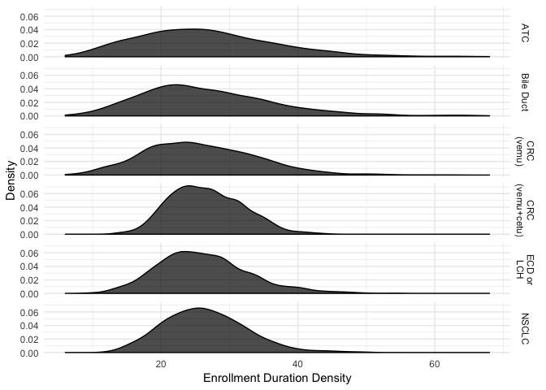

Simulate an Arm of a Clinical Trial
-----------------------------------

    library(trialsim)
    library(purrr)
    library(knitr)

    # Generate enrollment with 1 enrolee per time period.
    # Sample 2 trials each with 3 responses.
    arm_enroll(10) %>%
      arm_bin_resample(3, size = 2) %>% 
      kable()

<table>
<thead>
<tr class="header">
<th style="text-align: right;">period</th>
<th style="text-align: right;">enrolled</th>
<th style="text-align: right;">response</th>
<th style="text-align: right;">sim</th>
</tr>
</thead>
<tbody>
<tr class="odd">
<td style="text-align: right;">1</td>
<td style="text-align: right;">1</td>
<td style="text-align: right;">0</td>
<td style="text-align: right;">1</td>
</tr>
<tr class="even">
<td style="text-align: right;">2</td>
<td style="text-align: right;">1</td>
<td style="text-align: right;">0</td>
<td style="text-align: right;">1</td>
</tr>
<tr class="odd">
<td style="text-align: right;">3</td>
<td style="text-align: right;">1</td>
<td style="text-align: right;">1</td>
<td style="text-align: right;">1</td>
</tr>
<tr class="even">
<td style="text-align: right;">4</td>
<td style="text-align: right;">1</td>
<td style="text-align: right;">0</td>
<td style="text-align: right;">1</td>
</tr>
<tr class="odd">
<td style="text-align: right;">5</td>
<td style="text-align: right;">1</td>
<td style="text-align: right;">1</td>
<td style="text-align: right;">1</td>
</tr>
<tr class="even">
<td style="text-align: right;">6</td>
<td style="text-align: right;">1</td>
<td style="text-align: right;">0</td>
<td style="text-align: right;">1</td>
</tr>
<tr class="odd">
<td style="text-align: right;">7</td>
<td style="text-align: right;">1</td>
<td style="text-align: right;">1</td>
<td style="text-align: right;">1</td>
</tr>
<tr class="even">
<td style="text-align: right;">8</td>
<td style="text-align: right;">1</td>
<td style="text-align: right;">0</td>
<td style="text-align: right;">1</td>
</tr>
<tr class="odd">
<td style="text-align: right;">9</td>
<td style="text-align: right;">1</td>
<td style="text-align: right;">0</td>
<td style="text-align: right;">1</td>
</tr>
<tr class="even">
<td style="text-align: right;">10</td>
<td style="text-align: right;">1</td>
<td style="text-align: right;">0</td>
<td style="text-align: right;">1</td>
</tr>
<tr class="odd">
<td style="text-align: right;">1</td>
<td style="text-align: right;">1</td>
<td style="text-align: right;">1</td>
<td style="text-align: right;">2</td>
</tr>
<tr class="even">
<td style="text-align: right;">2</td>
<td style="text-align: right;">1</td>
<td style="text-align: right;">1</td>
<td style="text-align: right;">2</td>
</tr>
<tr class="odd">
<td style="text-align: right;">3</td>
<td style="text-align: right;">1</td>
<td style="text-align: right;">0</td>
<td style="text-align: right;">2</td>
</tr>
<tr class="even">
<td style="text-align: right;">4</td>
<td style="text-align: right;">1</td>
<td style="text-align: right;">0</td>
<td style="text-align: right;">2</td>
</tr>
<tr class="odd">
<td style="text-align: right;">5</td>
<td style="text-align: right;">1</td>
<td style="text-align: right;">0</td>
<td style="text-align: right;">2</td>
</tr>
<tr class="even">
<td style="text-align: right;">6</td>
<td style="text-align: right;">1</td>
<td style="text-align: right;">1</td>
<td style="text-align: right;">2</td>
</tr>
<tr class="odd">
<td style="text-align: right;">7</td>
<td style="text-align: right;">1</td>
<td style="text-align: right;">0</td>
<td style="text-align: right;">2</td>
</tr>
<tr class="even">
<td style="text-align: right;">8</td>
<td style="text-align: right;">1</td>
<td style="text-align: right;">0</td>
<td style="text-align: right;">2</td>
</tr>
<tr class="odd">
<td style="text-align: right;">9</td>
<td style="text-align: right;">1</td>
<td style="text-align: right;">0</td>
<td style="text-align: right;">2</td>
</tr>
<tr class="even">
<td style="text-align: right;">10</td>
<td style="text-align: right;">1</td>
<td style="text-align: right;">0</td>
<td style="text-align: right;">2</td>
</tr>
</tbody>
</table>

Simulate an Arm of a Clinical Trial with Poisson Enrollment
-----------------------------------------------------------

    # Generate enrollment based on a poisson distribution with rate parameter 0.8
    # then create all trial combinations with 3 responders.
    arm_enroll(10, partial(rpois, n = 1, lambda = 0.8)) %>%
      arm_bin_resample(3) %>%
      kable()

<table>
<thead>
<tr class="header">
<th style="text-align: right;">period</th>
<th style="text-align: right;">enrolled</th>
<th style="text-align: right;">response</th>
<th style="text-align: right;">sim</th>
</tr>
</thead>
<tbody>
<tr class="odd">
<td style="text-align: right;">2</td>
<td style="text-align: right;">2</td>
<td style="text-align: right;">0</td>
<td style="text-align: right;">1</td>
</tr>
<tr class="even">
<td style="text-align: right;">3</td>
<td style="text-align: right;">2</td>
<td style="text-align: right;">1</td>
<td style="text-align: right;">1</td>
</tr>
<tr class="odd">
<td style="text-align: right;">5</td>
<td style="text-align: right;">1</td>
<td style="text-align: right;">0</td>
<td style="text-align: right;">1</td>
</tr>
<tr class="even">
<td style="text-align: right;">9</td>
<td style="text-align: right;">1</td>
<td style="text-align: right;">0</td>
<td style="text-align: right;">1</td>
</tr>
<tr class="odd">
<td style="text-align: right;">15</td>
<td style="text-align: right;">2</td>
<td style="text-align: right;">1</td>
<td style="text-align: right;">1</td>
</tr>
<tr class="even">
<td style="text-align: right;">18</td>
<td style="text-align: right;">1</td>
<td style="text-align: right;">1</td>
<td style="text-align: right;">1</td>
</tr>
<tr class="odd">
<td style="text-align: right;">22</td>
<td style="text-align: right;">1</td>
<td style="text-align: right;">0</td>
<td style="text-align: right;">1</td>
</tr>
</tbody>
</table>

Simulate a Trial
----------------

    library(doParallel)
    library(doRNG)
    library(dplyr)

    registerDoParallel()
    registerDoRNG()

    # Create the vemurafenib data set.
    resps <- c(8, 0, 1, 1, 6, 2)
    size <- c(19, 10, 26, 8, 14, 7)
    name <- c("NSCLC", "CRC (vemu)", "CRC (vemu+cetu)", "Bile Duct", "ECD or LCH",
              "ATC")

    # Assume that the enrollment rate is inversely proportional to the
    # number enrolled.
    lambda <- size / max(size)

    # Use the sampler to change the enrollement duration.
    # Resample 1000 trials in parallel and keep track of their lengths
    trials <- bin_trial_resample(resps, size, name, 1000, sampler = poisson_sampler(lambda)) %>%
      group_by(name, sim) %>% 
      summarize(trial_length = max(period))

Get the Expected Arm Duration and SD
------------------------------------

    # Get the mean and sd of the trial durations.
    trials %>%
      group_by(name) %>% 
      summarize(mean_length = mean(trial_length), sd_length = sd(trial_length)) %>%
      kable()

<table>
<thead>
<tr class="header">
<th style="text-align: left;">name</th>
<th style="text-align: right;">mean_length</th>
<th style="text-align: right;">sd_length</th>
</tr>
</thead>
<tbody>
<tr class="odd">
<td style="text-align: left;">ATC</td>
<td style="text-align: right;">26.465</td>
<td style="text-align: right;">9.886785</td>
</tr>
<tr class="even">
<td style="text-align: left;">Bile Duct</td>
<td style="text-align: right;">26.632</td>
<td style="text-align: right;">9.528030</td>
</tr>
<tr class="odd">
<td style="text-align: left;">CRC (vemu)</td>
<td style="text-align: right;">25.792</td>
<td style="text-align: right;">8.130735</td>
</tr>
<tr class="even">
<td style="text-align: left;">CRC (vemu+cetu)</td>
<td style="text-align: right;">26.643</td>
<td style="text-align: right;">5.233253</td>
</tr>
<tr class="odd">
<td style="text-align: left;">ECD or LCH</td>
<td style="text-align: right;">26.203</td>
<td style="text-align: right;">6.597068</td>
</tr>
<tr class="even">
<td style="text-align: left;">NSCLC</td>
<td style="text-align: right;">26.463</td>
<td style="text-align: right;">6.039960</td>
</tr>
</tbody>
</table>

Plot the Density of the Arm Durations
-------------------------------------

    library(ggplot2)
    ggplot(trials, aes(x = trial_length, fill = name)) +
      geom_density(alpha = 0.7) +
      facet_grid( name ~ ., labeller = label_wrap_gen(width = 10)) +
      scale_fill_manual(values = rep("black", length(unique(trials$name))), guide = FALSE) +
      xlab("Enrollment Duration Density") +
      ylab("Density") +
      theme_minimal()

